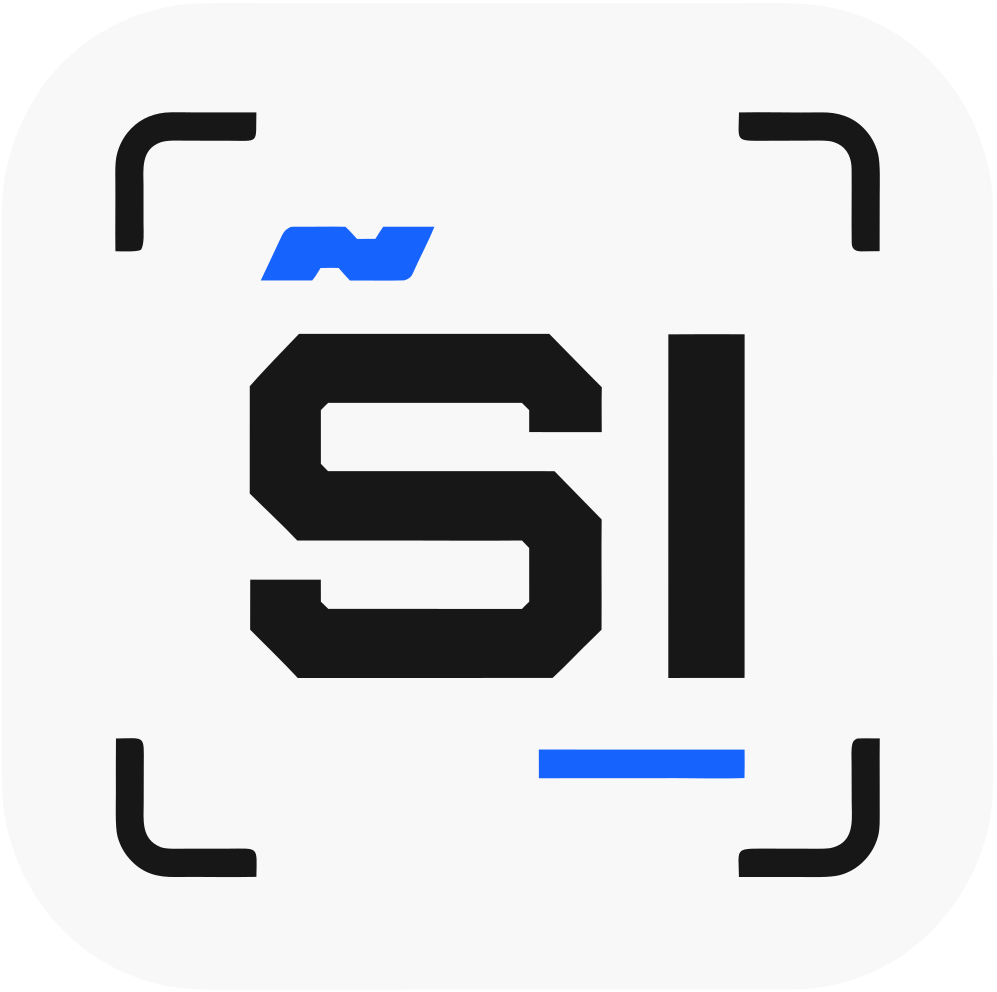

<!-- Profile Header -->
<h1 align="center">👋 Hey, I'm Syed Imadulla</h1>
<h3 align="center">🚀 Full Stack Developer | C++ & DSA | Turning Ideas Into Things</h3>

<!-- Banner / GIF -->

  

---

## 👨‍💻 About Me:

- 💻 Full-stack developer • React, Node.js, Express & MongoDB
- 🧠 Practicing **Data Structures & Algorithms in C++**
- 🎨 Into **frontend, UI/UX & creative web experiences**
- 🔨 Building practical projects and turning ideas into working products
- 🚀 Improving my **backend development, APIs & deployment skills**
- ⚡ **Chai ☕ + Code 💻 = Happiness 🔥**

---

### 🌐 Connect with Me

  

  

  

  

  

---

### ⚡ Languages & Tools

  

---

### 📊 GitHub Stats

  
  

  

  

---

### 🚀 Fun Add-ons

  

---
### 🌟 Open Source Badges

---

⭐️ From <a href="https://github.com/syed-imadulla">Syed Imadulla</a>

